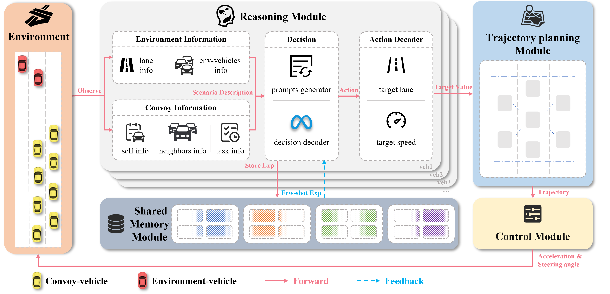
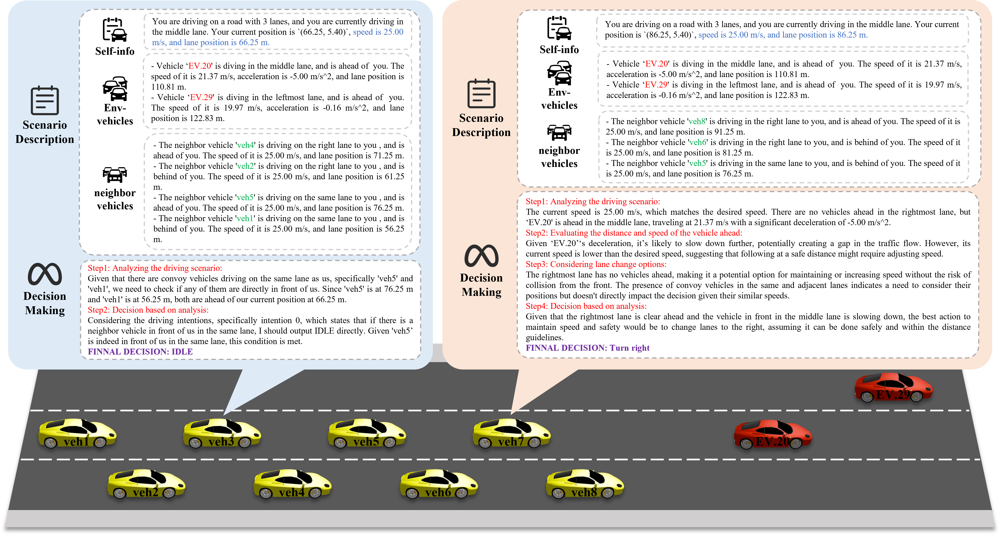

# ConvoyLLM: Dynamic Multi-Lane Convoy Control Using LLMs

## [Paper](https://arxiv.org/abs/2502.17529)
This is the official implementation of the paper ConvoyLLM: Dynamic Multi-Lane Convoy Control Using LLMs.

## Introduction
we introduce LLMs into multi-lane convoy control for the first time to enhance the convoy's adaptive capabilities and cooperation in complex scenarios. The main role of the LLM is to provide effective decision-making support for each vehicle in the convoy through efficient reasoning and generation capabilities. At the same time, we integrate a staggered formation control strategy based on locally dynamic distributed graphs, ensuring that the convoy maintains formation while exhibiting both flexibility and stability.


The overall framework of the multi-lane convoy formation control method. It contains a total of five modules: environment, reasoning, shared memory, trajectory planning, and control. The reasoning module obtains the perception results from the environment and generates the target lanes and target speeds of the vehicles, the trajectory planning module obtains the target values and generates the trajectories of each vehicle in the convoy, and finally the control module outputs the acceleration and steering angle commands, which are then applied to the environment.


A case of the Reasoning module process. This simple obstacle avoidance scenario illustrates how the reasoning module collects information from the ego vehicle, environment vehicles, and neighbors, then generates a scene description for decision-making by the large model. In the figure, veh7 changes lanes to the right due to a slow vehicle ahead, while veh3 outputs an IDLE decision to follow the neighboring vehicle in the same lane.

# Gettting Started
## Install SUMO
The SUMO version we used is 1.21.0. You can click this link to install [SUMO](https://sumo.dlr.de/docs/Installing/index.html).
## Install Ollama
We use a local LLM based on Ollama deployment, and LLM uses llama3.3:70b.
You can click this link to install [Ollama](https://ollama.com/).
## Install dependencies
- Create a new conda virtual env
```
conda env create -f environment.yml
conda activate Convoy
```
## Configuration
```
############ Large language model config ############
# ollama config or openai config
OPENAI_KEY: "sk-xxxxxx" # 'sk-xxxxxx'
OPENAI_CHAT_MODEL: "llama3.3:latest" # 'gpt-4-1106-preview' Alternative models: 'gpt-3.5-turbo-16k-0613' (note: performance may vary)
OPENAI_EMBEDDING_MODEL: "mxbai-embed-large:latest"
OPENAI_API_BASE: "http://localhost:11434/v1"

############### settings ############
SUMO_HOME: '/usr/bin/' # the path to the folder where the sumo,sumo-gui
few_shot_num: 3 # 0 for zero-shot
episodes_num: 50 # run episodes
memory_path: 'memories/20_mem'
result_folder: 'results'
simulation_duration: 2000 # step
all_vehicles_decision: False # To save simulation time, you can choose to make decisions only on the vehicle at the front of the lane, and the other vehicles will default to IDLE
task: 0 # [0,1,2,3] <--> [avoiding obstacles, joining convoy, leaving convoy, switching the escort formation]
```
# Contact
If you have any questions, please contact Zhican He via email (hezhican@whut.edu.cn).
# Citation
```
@article{lu2025convoyllm,
  title={ConvoyLLM: Dynamic Multi-Lane Convoy Control Using LLMs},
  author={Lu, Liping and He, zhican and Chu, Duanfeng and Wang, Rukang and Peng, saiqian and Zhou, Pan},
  journal={arXiv preprint arXiv:2502.17529},
  year={2025}}
```
# License
This repository is released under the Apache 2.0 license.
